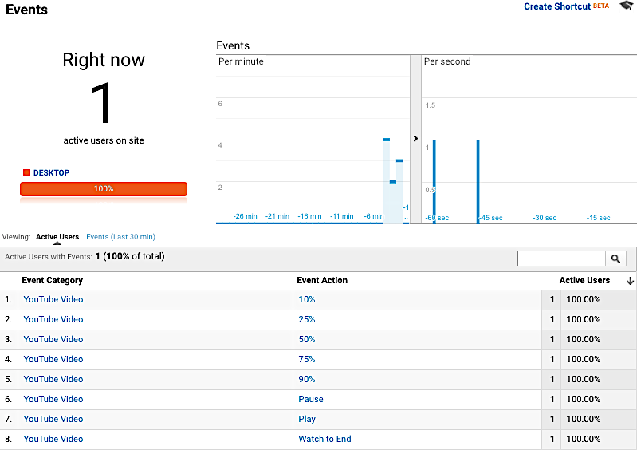
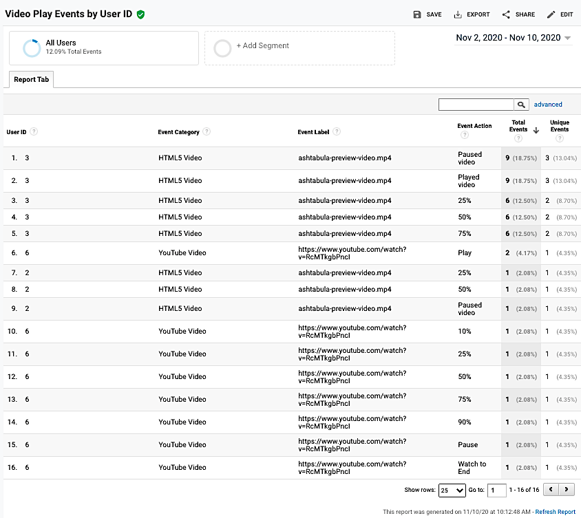

# cme-ga4yt

 Google Analytics for YouTube Tracking
 
 Play around with the [live demo](https://streetphotography.blog/youtube-video-tracking/).

---

## Install

1. Download the zip file from GitHub.
1. Log in to your WordPress site as an admin.
1. Navigate to Plugins > Add New.
1. Click Upload Plugin.
1. Select the zip file downloaded in step 1.
1. Click Install Now.
1. Click Activate.

Next: Write your filter hook for your user ID custom dimension index.

## PHP Filter Hook

Add a call to the `cme_user_id_custom_dimension_index` filter hook to your child theme’s functions.php file. Change the custom dimension index to match the user ID custom dimension index in your Google Analytics property.

```php
add_filter( 'cme_user_id_custom_dimension_index', function($custom_dimension_index) {
	return '5'; // Change this to match your CD index number that's set in GA.
} );

```

---

## Screen Captures

## Google Analytics Realtime YouTube Video Events Report


## Google Analytics Custom Report Showing YouTube Video Events by User ID


---

## Credits

The JavaScript source for tracking YouTube events was originally written by [LunaMetrics](http://www.lunametrics.com/). The code was forked from the [Bounteous repo](https://github.com/Bounteous-Inc/youtube-google-analytics).
